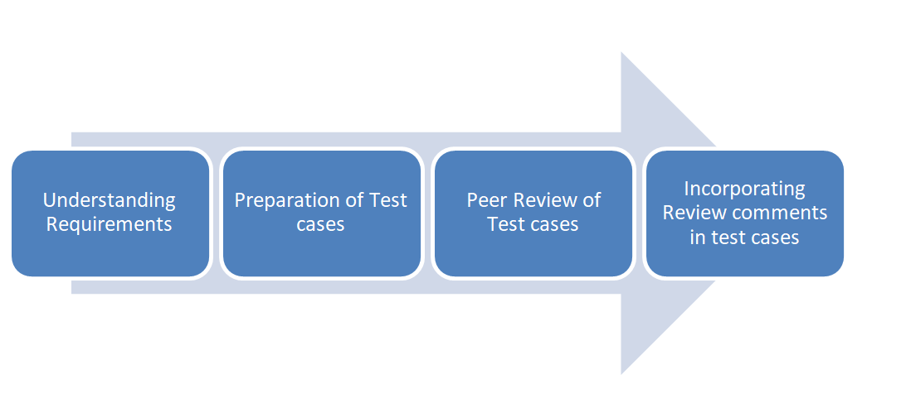
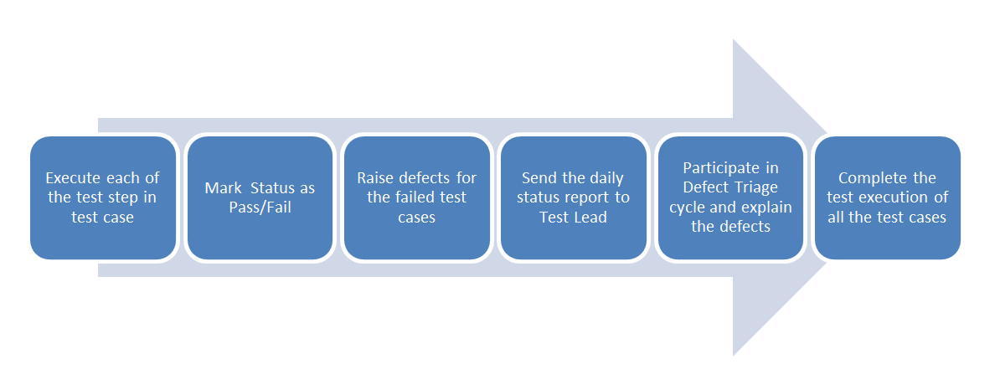

**Test Plan for Khan Academy Website:**
*Version 1,*
*31/12/20*

**1.1: Test Objectives:**
* The system is easy to use
* The functionality of the system components work perfectly
* Identify possible defects in the system

**1.2: Scope of Testing:**

The testing for the Khan Academy Software system will include testing the following functionality:
-	The searching functionality
-	The login scenarios
-	Change settings

The testing will not be include: 
-	The security of the system
-	The donation component.
-	Other functionalities which not mentioned in scoping.

The testing environment will be desktops and different mobile application according to the high level of usage. The testing will use the most recent versions of Google Chrome, Internet Explorer and Firefox Browsers.

**2: Approach:**
**2.1 Assumptions/Constraints**
**2.1.1 Assumptions** 
-	The website is accessed in the mentioned browsers and machines
-	The features of the websites, the prerequisites an behaviors of these features are well explained and understood by the team.
-	The acceptance criteria are well stated and explained.
**2.1.2 Constraints**
- limitation of time

**2.2 Coverage**
 Test coverage will be measured by: 
-	A completed matrix of testable requirements and test cases.
-	A completed documents on features and their behaviors prepared in Gherkin to be easily automated for regression testing.

**2.3 Test Tools**
-	Manual testing using test scenarios and cases
-	Automated testing using cucumber framework dependencies in node.js

**2.4 Test Type:**
Functional testing, by performing test cases based on testable requirements

**3. TEST MANAGEMENT PROCESS:**

**3.1 TEST MANAGEMENT PROCESS:**
 
**3.2 TEST EXECUTION PROCESS**
  

**4. Plan:**

**4.1: Required Resources**

**4.1.1 Test Team:**

|   **Title**  |   **Level of Involvement**   |  **Responsibilities**   |
| --- | --- | --- |
|Team Leader	| 40 hrs/wk	| Lead all testing activities, including test planning, test execution, and status reporting.|
|3 Independent Testers	|40 hrs/wk	|Design and execute test cases. Automate test cases and scenarios for system testing|
|Developers	| -	|To design and execute unit and integration testing|

**4.1.2: Training of the team**

**4.1.3: Hardware and other logistical requirements**

**4.2 Team Reviews:**

-	Test plan review 
-	Test case review 
-	Test progress review 
-	Post-test review

**4.3 Major Tasks and Deliverables**
|**Task**|	**Start date**	|**End date**	|**Deliverables**| 
| --- | --- | --- | --- |
|Prepare test scenarios and test cases|	1/1/2021|	2/1/2021|	Initial test scenarios and test cases framework|
|Review and approve test scenarios and test cases	| 2/1/2021	| 3/1/2021	| Approved test scenarios and test cases framework|
| Train test team	| 4/1/2021	| 6/1/2021	| Trained testers|
| Execute test scenarios and test cases	| 6/1/2021 |	9/1/2021 |	test summary and defects reports |
| Automate test cases for re-testing and regression testing |	10/1/2021	 | 13/1/2021|	Automated framework|
|Re-testing and regression testing	| 14/1/2021	|15/1/2021|	Final test report|

** 5. Features to be Tested:**
-	The searching functionality
-	The login scenarios.
-	Change settings.

**(These features are only examples. I can see the gaps in the features to be tested against the time and resources. I can understand here that the features are much less compared by the time and resources and it is not realistic. This just an example of test plan for homework submission purpose)**

**6. Features Not to be Tested**

-	The donation component.
-	Other functionalities which not mentioned in scoping.

**7.  Defect Management:**

The bugs or defects will be rated according to the priorities and risks as following:
- Critical	Business objectives or completion of test case are impacted.
- High	A certain functionality is not working as expected, for example, search button is not clickable
- Medium	Defects which provide invalid/incorrect information.
- Low	Defects related to esthetic of the website
- Info	This type of priority could be assigned to a work order for an item encountered that is not clear in the requirements.

**8. Risks and Contingencies**

|**Risk**|**Probability**	|**Impact**|**Contingencies**|
| --- | --- | --- | --- |
|**SCHEDULE**   Testing schedule is tight. If the start of the testing is delayed due to design tasks, the test cannot be extended beyond the UAT scheduled start date.|	High	|High	|•	The testing team can control the preparation tasks (in advance) and the early communication with involved parties. •	Some buffer has been added to the schedule for contingencies, although not as much as best practices advise. 
|**DEFECTS**   Defects are found at a late stage of the cycle or at a late cycle; defects discovered late are most likely be due to unclear specifications and are time consuming to resolve.  |Medium	|High|	Defect management plan is in place to ensure prompt communication and fixing of issues. 

