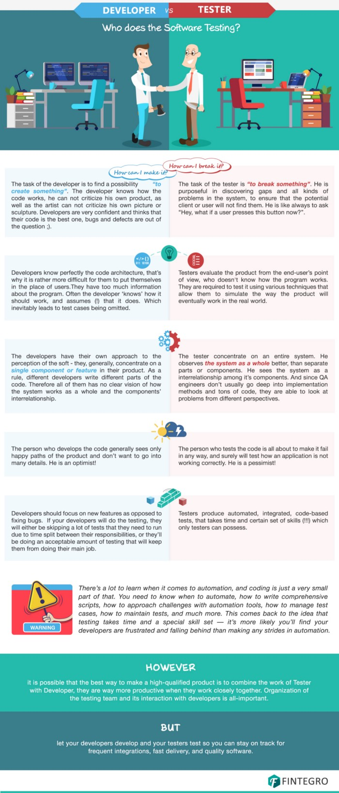

# Tester or Developer - What Suits You the Most?

As our world becomes increasingly digital, there has been an increase in the number of applications being developed for various platforms. No matter whether these apps are for a desktop, laptop, car, or mobile device, they all require a team of developers and testers in order to ensure that the app is completed within time, scope, and budget. The quality of the applications also needs to be top-notch to ensure that no bugs escape out into the wild. However, this may not be as easy as it sounds since the process of developing an application for any platform involves a lot of people working together to ensure that the final product is presentable and usable.

This repo will give you a small introduction to the differences between a development vs testing career so that you can discuss with the HYF team in case you want to pursue the latter.

## What Does a Developer Do?

Once the features of an app have been nailed down, they will be converted into actual applications. This is the role of the developer—using a variety of tools including programming languages, data structures, integrated development environments, staging servers, and more to get the system started. 

During the development process, the developer is required to write down and execute basic test cases which will determine whether the application is structurally sound and performing properly. This is usually done through a process known as unit testing. It is important to note that unit testing is not the same as the testing that is done by the tester. Unit tests are used by developers to determine any obvious bugs and ensure that the program works as expected. However, there are other bugs that may not be caught early enough by the developer and this is where the tester’s role comes in.

## What Does a Tester Do?
A tester is the person responsible for trying out all the different usage scenarios for an application in order to ensure that it works as expected. The tester reports back to the development team listing the bugs that were discovered and what series of actions led to that particular error. 

These defects, or bugs, are usually addressed before the application can be deployed or shipped to consumers. The work of the tester involves carrying out several activities inside the application—just like a normal user would do. For example, the tester will to try out several different approaches to doing the same thing in order to determine whether a specific combination of steps may lead to an error message, the program crashing, or other unexpected result.

It is very important that software bugs are caught as early as possible. When bugs appear in a real-world environment, they can incur decreases in revenue as well as increased costs to fix the bugs. With a tester as part of the development cycle, an application will be shipped with the fewest possible bugs—since the major ones have been discovered by the tester. In short, the work of the tester is to find bugs before they are caught in the wild. In their own way, the tester helps to reduce the overall cost of the project—and that can really add up!

Check out this cool infographic about the work of a tester vs the work of a developer!

## The typical job description for a QA engineer or tester

While the job description for a QA changes according to the exact role and company, below you can find a list of the most common responsibilities and requirements for the role.

### Main Responsibilities:
QA engineer responsibilities include designing and implementing tests, debugging and defining corrective actions. Ideal candidates are responsible for conducting tests before product launches to ensure software runs smoothly and meets client needs, while being cost-effective. Ultimately, you should monitor all stages of software development to identify and resolve system malfunctions to meet quality standards. Most common responsibilities include:

- Review requirements, specifications and technical design documents to provide timely and meaningful feedback
- Create detailed, comprehensive and well-structured test plans and test cases
- Estimate, prioritize, plan and coordinate testing activities
- Design, develop and execute automation scripts using different tools and programming languages
- Identify, record, document thoroughly and track bugs
- Develop and apply testing processes for new and existing products to meet client needs
- Liaise with internal teams (e.g. developers and product managers) to identify system requirements
- Investigate the causes of non-conforming software and train users to implement solutions
- Track quality assurance metrics, like defect densities and open defect counts
- Stay up-to-date with new testing tools and test strategies

### Requirements
- Knowledge of software development
- Knowledge of software quality assurance
- Strong knowledge of software QA methodologies, tools and processes
- Writing clear, concise and comprehensive test plans and test cases
- Hands-on experience with automated testing tools
- Experience working in an Agile/Scrum development process

### Real job descriptions
- Mobile QA Engineer at Backbase (Link)
- Software Test Engineer at Deloitte (Link)

## Tester or Developer?

To decide between tester vs. developer, your career choice will depend on your particular interests in the world of software development. A developer needs to have programming skills and proficiency at writing code. Development is usually about creating prototypes and testing these prototypes until they are able to function.

A tester, on the other hand, is responsible for testing the application and pushing it to its limits. The tester needs to have deep knowledge of the system that is being developed (and the technical skills for automation testing) as well as great communication skills. Communication skills are necessary because the tester will be reporting the bugs back to the development team so that they can work on the errors and fix them. 

## Frequently Asked Questions:

- If I choose to pursue a career in testing, was HackYourFuture a waste of time?
Not at all! As a software tester, especially when working in automation, you will need to use most of the skills you learned in our program and more!

- Are there more jobs available in testing than in development?
Fortunately, the are plenty of vacancies in both roles for those who work hard and never stop learning. From time to time, we get approached by a company interested in hiring QA developers and in those cases, a quicker matching might be possible.

- Will I earn more as a developer than a tester?
The information on this topic varies quite a lot. Still, is safe to say that this will mainly depend on your skills, company, etc. The more specialized you become at any of the professions, the more you learn and the more your experience, you will be able to achieve a great salary in both.

- Can testers become developers? 
Absolutely! Not only that, many people say they can become better developers than people who don’t have any testing experience. Anyway, we strongly recommend you to choose a path based on what you like and gets you more enthusiastic and not because of the pay or other factors.

- Are there HYF graduates working as testers?
Absolutely! If you are considering a career as a tester get in touch with the HYF team so we can schedule a call with you and invite QA developer grads and mentors!

## Interesting videos and articles you should check out!

-[Programming Foundations: Software Testing/QA | Video](https://www.linkedin.com/learning/programming-foundations-software-testing-qa/set-the-standard-with-quality-assurance-qa): Check the into section only!
- [Insights on Software Quality Engineering | Video](https://www.linkedin.com/learning/insights-on-software-quality-engineering/welcome)
- [The Path to Becoming a QA Engineer](https://medium.com/@paysa/the-path-to-becoming-a-qa-engineer-14735196a68b)
- [https://qa-academy.lv/en/qa-engineer-job-4-possible-career-paths/](https://qa-academy.lv/en/qa-engineer-job-4-possible-career-paths/)
- [The different types of software testing](https://www.atlassian.com/continuous-delivery/software-testing/types-of-software-testing)
- [QA Engineers: practices and tips for businesses](https://www.ssa.group/blog/qa-engineers-practices-and-tips-for-businesses)

